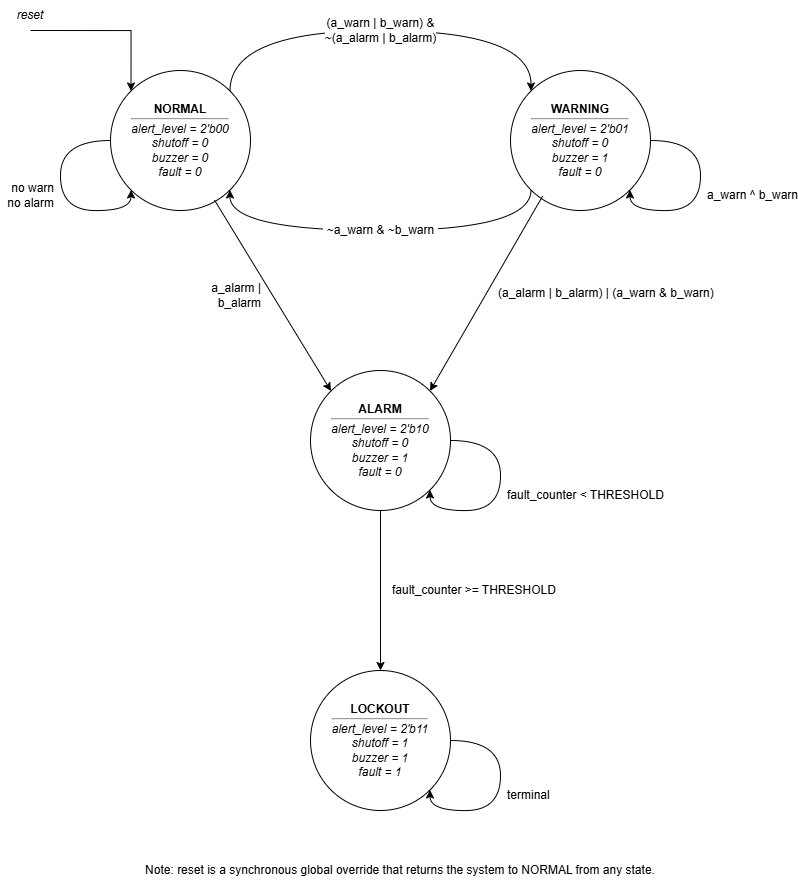
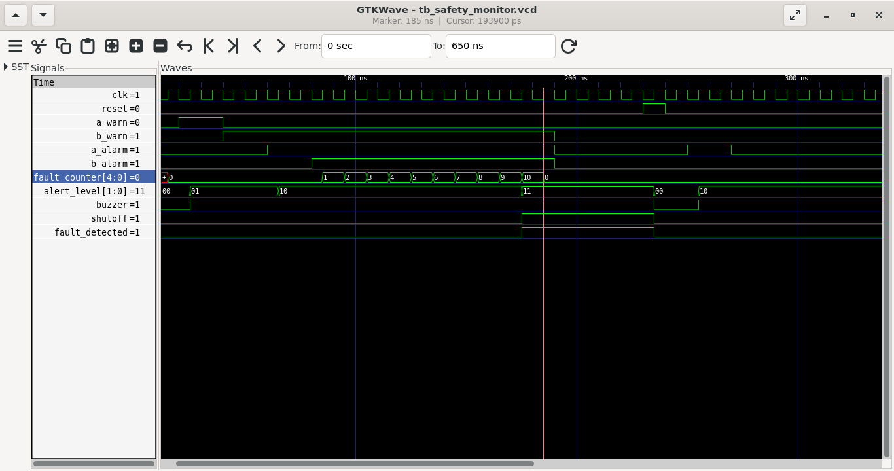

# Safety Monitor FSM: IoT Multi-Gas Detection System

## Overview

This project is a rigorously verified RTL (Register Transfer Level) implementation of a Safety Monitor Finite State Machine (FSM) written in SystemVerilog.

This digital logic core acts as the primary safety controller for an **IoT Multi-Gas Detection System**. While physical sensors (e.g., MQ-series) handle analog gas concentration readings, this hardware module processes the digitized thresholds to manage system states, trigger physical alarms, and strictly enforce a non-recoverable lockout protocol to mitigate catastrophic multi-gas faults.

## Architecture & Logic

*(System Architecture Blueprint)*

The system is implemented as a 3-block Moore FSM with an integrated 10-cycle fault integration counter. To prevent expensive nuisance shutoffs from transient sensor glitches, the FSM separates the conceptual "Danger" state into a two-tiered escalation protocol:

### State Machine Protocol

* **NORMAL (00):** System is idle. Sensors read safe levels. All outputs driven low.
* **WARNING (01):** A single sensor detects elevated gas levels. The `buzzer` is triggered to alert personnel, but operations continue.
* **ALARM (10) [The Grace Period]:** A critical threshold is breached. The system **latches** into this state, ensuring the buzzer sounds continuously to mandate human inspection even if the gas briefly clears. A 10-clock-cycle fault integration timer begins. 
* **LOCKOUT (11) [The Mitigation State]:** If the fault counter saturates (indicating a persistent, dangerous gas leak for 10 continuous clock cycles), the system enters a hard lockout. A physical `shutoff` signal is asserted to close physical valves and cut machine power. **This is a non-recoverable safety trap.** The system cannot exit this state—even if the gas completely clears—without a manual physical `reset` from a safety officer.

### Port Map

| Type | Signal | Width | Description | 
| :--- | :--- | :--- | :--- | 
| **Input** | `clk` | 1-bit | System clock | 
| **Input** | `reset` | 1-bit | Active-high synchronous global reset | 
| **Input** | `a_warn`, `b_warn` | 1-bit | Sensor A/B early warning thresholds | 
| **Input** | `a_alarm`, `b_alarm` | 1-bit | Sensor A/B critical thresholds | 
| **Output** | `alert_level` | 2-bit | Current FSM state (00, 01, 10, 11) | 
| **Output** | `buzzer` | 1-bit | High during Warning, Alarm, and Lockout | 
| **Output** | `shutoff` | 1-bit | High only during Lockout (drives physical safety relay) | 
| **Output** | `fault_detected` | 1-bit | Asserts when the 10-cycle integration counter saturates | 

## Simulation & Verification

The design is fully verified using Icarus Verilog and GTKWave. The testbench (`tb_safety_monitor.sv`) is an **automated self-checking environment** that mathematically evaluates the expected outputs across multiple complex scenarios without requiring manual waveform inspection.

The test suite automatically verifies:

* Basic state transitions and combinational output assignments.
* Sub-clock-cycle glitch immunity (debouncing noise).
* Latching behavior of the ALARM state when gas clears prior to threshold.
* The exact 10-cycle fault integration boundary.
* Lockout priority over downgraded warnings.

### How to Run Locally

A bash automation script is provided for one-click compilation and simulation.

1. Ensure `iverilog` and `gtkwave` are installed on your Linux/WSL environment.
2. Make the script executable: `chmod +x sim_run.sh`
3. Run the pipeline: `./sim_run.sh`

### Verification Evidence

*(Below: Visual proof of the environmental fault injection. The system correctly identifies a critical dual-alarm fault, counts exactly 10 clock cycles [0 to 10 in decimal], drops the `shutoff` hammer by transitioning to state `11`, and securely traps the system in LOCKOUT even when the physical sensors subsequently drop back to safe levels).*

