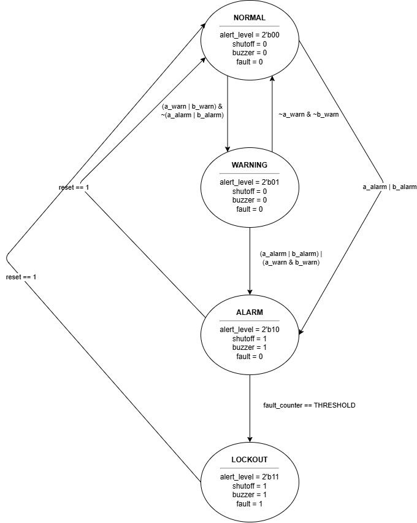

# Safety Monitor FSM: IoT Multi-Gas Detection System

## Overview

This project is an RTL (Register Transfer Level) implementation of a Safety Monitor Finite State Machine (FSM) written in SystemVerilog.

This digital logic core was designed to act as the primary safety controller for an **IoT Multi-Gas Detection System**. While the physical sensors (MQ series) read the analog gas concentrations, this hardware module processes the digitized thresholds to manage system states, trigger physical buzzers, and strictly enforce a non-recoverable lockout protocol to prevent hardware damage during critical multi-gas faults.

## Architecture

*(FSM Architecture Blueprint)*

The system is implemented as a 3-block Moore FSM with an integrated 10-cycle fault integration counter.

### State Machine Protocol

* **NORMAL (00):** System is idle. Sensors read safe levels.

* **WARNING (01):** A single sensor detects elevated gas levels. Buzzer is triggered.

* **ALARM (10):** A critical threshold is reached. If two sensors hit ALARM simultaneously, a 10-clock-cycle fault counter begins.

* **LOCKOUT (11):** If the fault counter saturates, the system enters a hard lockout. A physical shutoff signal is asserted to close valves/power. **Crucially, the system cannot exit this state even if the gas clears.** It requires a manual physical `reset` to recover.

### Port Map

| Type | Signal | Width | Description | 
| :--- | :--- | :--- | :--- | 
| **Input** | `clk` | 1-bit | System clock | 
| **Input** | `reset` | 1-bit | Active-high synchronous reset | 
| **Input** | `a_warn`, `b_warn` | 1-bit | Sensor A/B early warning thresholds | 
| **Input** | `a_alarm`, `b_alarm` | 1-bit | Sensor A/B critical thresholds | 
| **Output** | `alert_level` | 2-bit | Current FSM state (00, 01, 10, 11) | 
| **Output** | `buzzer` | 1-bit | High during Warning, Alarm, and Lockout | 
| **Output** | `shutoff` | 1-bit | High only during Lockout (drives safety relay) | 
| **Output** | `fault_detected` | 1-bit | Asserts when the 10-cycle integration counter saturates | 

## Simulation & Verification

The design is fully verified using Icarus Verilog and GTKWave. The testbench (`tb_safety_monitor.sv`) injects 11 distinct scenarios including normal operations, glitch immunity, priority overrides, and the critical lockout trap.

### How to Run Locally

A bash automation script is provided for one-click compilation and simulation.

1. Ensure `iverilog` and `gtkwave` are installed.
2. Make the script executable: `chmod +x sim_run.sh`
3. Run the pipeline: `./sim_run.sh`

### Verification Evidence

*(See below for visual proof of the FSM correctly trapping the system in LOCKOUT after a 10-cycle dual-alarm fault, even when sensors subsequently drop back to safe levels).*

